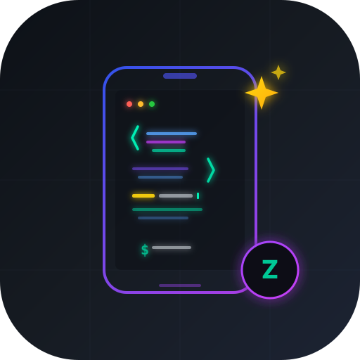

<p align="center">
  
</p>

<h1 align="center">ZCode for Termux</h1>

<p align="center">
  <strong>The full GLM-5.3 AI coding IDE — running natively on your Android phone.</strong>
</p>

<p align="center">
  <a href="https://github.com/NaustudentX18/zcode-termux/releases"></a>
  <a href="https://zcode.z.ai"></a>
  <a href="https://z.ai/subscribe"></a>
  
  
</p>

<p align="center">
  <a href="#-quick-start">Quick Start</a> ·
  <a href="#-features">Features</a> ·
  <a href="#-how-it-works">How It Works</a> ·
  <a href="#-environment-detection">Environment Detection</a> ·
  <a href="#-troubleshooting">Troubleshooting</a> ·
  <a href="#-uninstall">Uninstall</a>
</p>

---

## 📱 What is this?

[ZCode](https://zcode.z.ai) is the official harness for **GLM-5.3** — a full-featured AI coding IDE built on Electron (Chromium + Node.js) with multi-agent orchestration, skills, MCP server support, and deep GLM integration.

**It ships for desktop only (macOS / Windows / Linux).**

This repo turns the official Linux ARM64 `.deb` into a **one-shot install** that runs inside Termux on your Android phone via `proot-distro` + Debian + Termux:X11. No APK, no rooting, no compilation — just clone and run.

---

## 🚀 Quick Start

```bash
# 1. Install Termux from F-Droid (NOT Play Store — that version is dead)
#    → https://f-droid.org/packages/com.termux/

# 2. Install git
pkg install git -y

# 3. Clone this repo
git clone https://github.com/NaustudentX18/zcode-termux.git
cd zcode-termux

# 4. Run the installer (takes 5-10 min)
bash install.sh

# 5. Launch ZCode
zcode
```

That's it. The installer auto-detects your device, configures everything, and drops a `zcode` command in your PATH plus a home-screen widget shortcut.

---

## ✨ Features

### Full ZCode IDE
- GLM-5.3 AI agent with multi-task orchestration
- Monaco code editor with syntax highlighting
- Integrated terminal (bash)
- Git integration (commit, diff, history)
- File explorer with full project awareness
- Extension marketplace access
- Skills system with auto-loading

### Mobile-Optimized
- **Touch targets** — all buttons enlarged to 44px minimum for finger taps
- **Wider scrollbars** — 16px drag handles for touch
- **Pinch-to-zoom** enabled on the whole window
- **Scaled fonts** — auto-scaled based on your screen DPI
- **Virtual keyboard** support in terminal and editor
- **Compact sidebar** — 56px activity bar for thumb reach
- **Gesture scrolling** — smooth momentum scroll

### Environment-Aware
The installer runs a **full device probe** and writes a persistent config:

| Detected | Used For |
|---|---|
| Device model & brand | Bug report context |
| Android version + SDK level | Compatibility checks |
| CPU architecture & core count | Process limit tuning |
| Total RAM | Electron memory allocation (1.5GB → 4GB tiers) |
| Screen DPI | UI scale factor + font size |
| GPU renderer (Adreno/Mali/PowerVR) | GPU acceleration vs software rendering |
| Available storage | Pre-flight check |
| Root status | Diagnostic info |

### Pre-Installed Dev Stack
The Debian proot comes loaded with:
- **Node.js 20 LTS** + npm + TypeScript + ts-node
- **Python 3** + pip + venv
- **Git** with auto-fetch enabled
- **ripgrep, fd-find, bat, jq, htop** — modern CLI tools
- **clang, make, cmake, pkg-config** — build tools
- **MCP servers** — filesystem, git, fetch, memory

### Pre-Configured Skills
10 skills auto-load on first launch:

| Skill | Trigger Keywords | What It Does |
|---|---|---|
| Code Review | "review", "code review" | Severity-rated automated review |
| Git Master | "commit", "git", "rebase" | Atomic commits, rebases, history |
| TDD Mode | "tdd", "test", "red-green" | Test-first development loop |
| Architect | "architect", "design", "plan" | Architecture analysis (read-only) |
| Debugger | "debug", "fix", "broken" | Root-cause diagnosis loop |
| Refactor | "refactor", "rename", "extract" | Safe surgical refactoring |
| Security Scan | "security", "vulnerability" | OWASP Top 10 detection |
| Docs Generator | "document", "readme", "docs" | Auto-generate documentation |
| Deploy | "deploy", "build", "ship" | Build & deploy orchestration |
| Mobile Dev | "mobile", "android", "termux" | Termux/proot-aware dev context |

---

## 🏗 How It Works

```
┌─────────────────────────────────────────────────────┐
│  Android (aarch64)                                  │
│                                                     │
│  ┌───────────────────────────────────────────────┐  │
│  │  Termux (terminal emulator)                   │  │
│  │                                               │  │
│  │  ┌─────────────────────────────────────────┐  │  │
│  │  │  proot-distro → Debian ARM64 (chroot)    │  │  │
│  │  │                                         │  │  │
│  │  │  ┌───────────────────────────────────┐  │  │  │
│  │  │  │  ZCode (Electron)                  │  │  │  │
│  │  │  │  ├── Chromium rendering engine     │  │  │  │
│  │  │  │  ├── Node.js runtime               │  │  │  │
│  │  │  │  ├── Monaco editor                 │  │  │  │
│  │  │  │  ├── GLM-5.3 agent                 │  │  │  │
│  │  │  │  ├── Skills (10 pre-loaded)        │  │  │  │
│  │  │  │  ├── MCP servers (4 configured)    │  │  │  │
│  │  │  │  └── Mobile touch CSS (injected)   │  │  │  │
│  │  │  └───────────────────────────────────┘  │  │  │
│  │  └─────────────────────────────────────────┘  │  │
│  │                                               │  │
│  │  Termux:X11 ← display server ( Wayland )      │  │
│  │  PulseAudio ← audio server                     │  │
│  └───────────────────────────────────────────────┘  │
└─────────────────────────────────────────────────────┘
```

ZCode is an Electron app. Android can't run Electron natively (no desktop Chromium, no Node.js). This project bridges that gap by running a **Debian ARM64 chroot inside Termux** via `proot-distro`, installing the official Linux ARM64 `.deb` there, and launching it with **Termux:X11** providing the display server.

No root required. `proot` uses `ptrace` to fake `chroot` without kernel privileges.

---

## 🔍 Environment Detection

When you run `install.sh`, it probes your device and generates a persistent config:

```
┌─────────────────────────────────────────────┐
│        ENVIRONMENT DETECTION REPORT         │
├─────────────────────────────────────────────┤
│ Device:        Samsung SM-S928B             │
│ Manufacturer:  samsung                       │
│ Android:       v14 (SDK 34)                 │
│ CPU:           aarch64 (8 cores)             │
│ RAM:           12288 MB                     │
│ Storage free:  84521 MB                     │
│ Screen DPI:    480                           │
│ Rooted:        false                        │
│ Termux prefix: /data/data/com.termux/...    │
│ proot-distro:  true                          │
│ Debian proot:  false                        │
└─────────────────────────────────────────────┘
```

This config drives:
- **Memory tiers** — 4GB / 6GB / 8GB+ RAM each get different Electron heap limits and renderer process counts
- **GPU flags** — Adreno/Mali/PowerVR get hardware acceleration; unknown GPUs fall back to SwiftShader
- **UI scaling** — DPI → scale factor (160dpi=1.0, 480dpi=3.0), clamped to [1.0, 3.0]
- **Font size** — 13px / 14px / 16px based on DPI tier

The config is written to `~/.config/zcode-termux/mobile-env.sh` and sourced by the launcher on every `zcode` invocation.

---

## 📋 Requirements

| Requirement | Minimum | Recommended |
|---|---|---|
| **Architecture** | aarch64 (ARM64) | — |
| **Android** | 10 (SDK 29) | 13+ |
| **RAM** | 4 GB | 8 GB+ |
| **Storage** | 2 GB free | 4 GB free |
| **Termux** | From [F-Droid](https://f-droid.org/packages/com.termux/) | + Termux:Widget add-on |
| **Display** | Termux:X11 (auto-installed) | — |
| **GLM API key** | — | [z.ai/subscribe](https://z.ai/subscribe) |

> ⚠️ **Do not install Termux from the Play Store** — Google's version is deprecated and broken. Use F-Droid or the direct APK from [Termux's GitHub releases](https://github.com/termux/termux-app/releases).

---

## 🎮 Launching

### From terminal
```bash
zcode
```

### From home screen
1. Install **Termux:Widget** from F-Droid
2. Long-press your home screen → Add Widget → Termux:Widget
3. Select the **ZCode** shortcut
4. Tap to launch anytime

### First launch
First launch takes **10-20 seconds** — proot spins up Debian, Termux:X11 initializes the display, and Electron loads. Subsequent launches are faster (Debian proot caches).

---

## 🔧 Troubleshooting

<details>
<summary><b>📦 ZCode won't launch / blank screen</b></summary>

```bash
# Check if Termux:X11 is running
ps aux | grep termux-x11

# Kill stale processes and retry
pkill -f termux-x11
zcode

# Launch manually to see error output
proot-distro login debian --shared-tmp -- \
  bash -c "DISPLAY=:0 /usr/bin/zcode --no-sandbox --enable-logging"
```
</details>

<details>
<summary><b>🔧 dpkg dependency errors during install</b></summary>

```bash
proot-distro login debian -- bash -c \
  "apt-get update && apt-get install -f -y && dpkg --configure -a"
```

Then re-run `bash install.sh`.
</details>

<details>
<summary><b>💾 Out of memory / crashes / OOM-killed</b></summary>

Electron is memory-heavy. The installer auto-tunes based on your RAM, but if you're still crashing:

```bash
# Reduce Electron memory in the launcher
sed -i 's/--max-old-space-size=[0-9]*/--max-old-space-size=512/' $PREFIX/bin/zcode
```

Also: close other apps, disable other proot distros (`proot-distro remove ubuntu` etc).
</details>

<details>
<summary><b>🔑 GLM API key not set / AI features not working</b></summary>

Get a key from [z.ai/subscribe](https://z.ai/subscribe), then:

```bash
# Set it in ZCode's config
proot-distro login debian -- bash -c \
  "echo 'export ZAI_API_KEY=your-key-here' >> /root/.bashrc"

# Or set it in ZCode Settings → AI → API Key
```

The **GLM Coding Lite** plan is $12.6/month and includes 10,000 credits/week.
</details>

<details>
<summary><b>🖥 GPU rendering issues / flickering</b></summary>

The installer auto-detects your GPU. If you get artifacts:

```bash
# Force software rendering
sed -i 's/--enable-gpu-rasterization/--disable-gpu/' $PREFIX/bin/zcode
```
</details>

<details>
<summary><b>📱 Touch input not working properly</b></summary>

Make sure Termux:X11 is the latest nightly:
```bash
pkg uninstall termux-x11
pkg install termux-x11-nightly
```

The mobile touch CSS is injected automatically. If it's not loading, verify:
```bash
cat ~/.config/zcode-termux/mobile-env.sh | grep GPU_FLAGS
```
</details>

---

## 🗑 Uninstall

```bash
# Quick uninstall (removes ZCode, launcher, shortcuts)
bash uninstall.sh

# Full removal (also deletes Debian proot — reclaims ~1.5GB)
bash uninstall.sh --full
```

Or manually:
```bash
rm $PREFIX/bin/zcode
rm ~/.shortcuts/ZCode
proot-distro remove debian
```

---

## 📁 Repo Structure

```
zcode-termux/
├── assets/
│   ├── logo.svg              # Main logo (512×512, animated)
│   └── logo-128.svg          # Favicon size (128×128)
├── scripts/
│   ├── env-detect.sh         # Device probe + mobile config generator
│   ├── bootstrap-skills.sh   # Pre-load skills, MCP, settings, dev tools
│   └── mobile-touch.css      # Touch-optimized CSS injected into Electron
├── .github/
│   └── workflows/
│       └── release.yml       # Auto-release on tag push
├── install.sh                # ← You run this
├── uninstall.sh              # ← Or this to remove
├── README.md                 # You are here
├── LICENSE                   # MIT
├── CHANGELOG.md              # Version history
└── .gitignore
```

---

## 🔗 Links

| Resource | URL |
|---|---|
| **ZCode official site** | [zcode.z.ai](https://zcode.z.ai) |
| **GLM API subscription** | [z.ai/subscribe](https://z.ai/subscribe) |
| **Termux (F-Droid)** | [f-droid.org/packages/com.termux](https://f-droid.org/packages/com.termux/) |
| **Termux:Widget** | [f-droid.org/packages/com.termux.widget](https://f-droid.org/packages/com.termux.widget/) |
| **ZCode downloads** | [zcode.z.ai/en#all-downloads](https://zcode.z.ai/en#all-downloads) |
| **Report issues** | [GitHub Issues](https://github.com/NaustudentX18/zcode-termux/issues) |

---

## ⚖️ Disclaimer

This is an **unofficial community project**. ZCode is built by [z.ai](https://z.ai). This repo automates installing the official Linux ARM64 `.deb` inside a Termux proot environment — it does not modify, crack, or redistribute ZCode itself. Not affiliated with or endorsed by z.ai.

Use at your own risk. The proot approach has ~10-15% CPU overhead vs native Linux.

---

## 📄 License

MIT © 2026 [NaustudentX18](https://github.com/NaustudentX18)